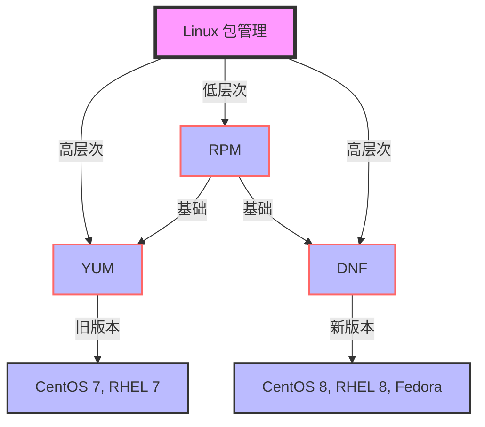

Red Hat 底层包管理器。

## 1. 简介

`rpm` 是 Red Hat Package Manager 的缩写，是 Red Hat 系列 Linux 发行版（如 CentOS、RHEL、Fedora 等）用于管理软件包的工具。它允许你安装、查询、验证、更新和删除软件包，确保系统的软件环境保持最新和完整。🖥️

## 2. rpm、yum 和 dnf 的区别与关系

- `rpm` 是底层包管理工具。
- `yum` 和 `dnf` 都是基于 `rpm` 的高层次包管理工具。
- `yum` 主要用于较旧的 Red Hat 系列发行版（如 CentOS 7、RHEL 7）。
- `dnf` 是 `yum` 的继任者，用于较新的 Red Hat 系列发行版（如 CentOS 8、RHEL 8、Fedora）。

我们可以使用 mermaid 图形展示它们之间的关系


### 2.1 rpm 的简介

- **RPM**：
  - 低层次包管理器，主要用于直接操作 RPM 包文件。
  - 不自动处理依赖关系，需要手动解决。

### 2.2 yum 的简介

- **YUM**：
  - 基于 RPM 的高层次包管理器，提供了仓库管理、依赖自动解决、软件包更新等功能。
  - 适用于较旧的 Red Hat 系列发行版（如 CentOS 7、RHEL 7）。

### 2.3 dnf 的简介

- **DNF**：
  - 是 YUM 的继任者，提供更好的性能、更安全的更新机制、更丰富的功能（如模块管理）。
  - 适用于较新的 Red Hat 系列发行版（如 CentOS 8、RHEL 8、Fedora）。

**关键区别**：
- **层级**：`rpm` 是底层工具，`yum` 和 `dnf` 是基于 `rpm` 的高层次工具。
- **依赖管理**：`yum` 和 `dnf` 自动处理依赖关系，而 `rpm` 需要手动解决。
- **适用性**：`yum` 主要用于较旧的 Red Hat 系列发行版，`dnf` 是现代化的替代品，适用于较新的发行版。

这些工具在 Linux 生态系统中共同服务于包管理的不同需求，`rpm` 提供基础操作，`yum` 和 `dnf` 提供了更便捷的管理体验。

## 3. 常见操作概览 📋

| 操作                    | 命令格式                           | 说明                                 |
|-------------------------|-----------------------------------|--------------------------------------|
| 安装 RPM 包             | `rpm -ivh <包名.rpm>`              | 安装指定的 RPM 包。                  |
| 查询已安装包            | `rpm -q <包名>`                    | 查询已安装的软件包。                 |
| 列出所有已安装包        | `rpm -qa`                         | 列出系统中所有已安装的软件包。       |
| 查询包文件列表          | `rpm -ql <包名>`                   | 列出指定包中的文件列表。             |
| 验证包的完整性          | `rpm -V <包名>`                    | 验证已安装包的完整性。               |
| 更新或升级包            | `rpm -Uvh <包名.rpm>`              | 更新或升级指定的 RPM 包。            |
| 删除包                  | `rpm -e <包名>`                    | 删除指定的软件包。                   |

## 4. 命令示例 ⚡

### 4.1 安装 RPM 包

要安装一个 RPM 包，可以使用 `rpm -ivh` 命令：

```bash
$ sudo rpm -ivh example.rpm
```

此命令会安装 `example.rpm` 包，并显示安装进度。

### 4.2 查询已安装包

查询某个包是否已安装：

```bash
$ rpm -q example
```

如果 `example` 包已安装，会显示包的版本信息。

### 4.3 列出所有已安装包

列出系统中所有已安装的软件包：

```bash
$ rpm -qa
```

此命令会列出所有已安装的包名。

### 4.4 查询包文件列表

查看指定包中的文件列表：

```bash
$ rpm -ql example
```

此命令会列出 `example` 包中包含的所有文件。

### 4.5 验证包的完整性

验证已安装包的完整性：

```bash
$ rpm -V example
```

此命令会检查 `example` 包的文件是否被修改过。

### 4.6 更新或升级包

更新或升级指定的 RPM 包：

```bash
$ sudo rpm -Uvh example.rpm
```

此命令会更新或升级 `example.rpm` 包，并显示安装进度。

### 4.7 删除包

删除指定的软件包：

```bash
$ sudo rpm -e example
```

此命令会删除 `example` 包及其所有依赖。

## 5. 常用选项 📝

- `-i` 或 `--install`：安装包。
- `-v` 或 `--verbose`：显示详细信息。
- `-h` 或 `--hash`：安装过程中显示进度条。
- `-q` 或 `--query`：查询包。
- `-a` 或 `--all`：查询所有包。
- `-l` 或 `--list`：列出包中的文件。
- `-V` 或 `--verify`：验证包的完整性。
- `-U` 或 `--upgrade`：更新或升级包。
- `-e` 或 `--erase`：删除包。
- `--force`：强制安装，即使包已存在。
- `--nodeps`：忽略依赖关系。
- `--test`：测试安装，不实际安装包。

## 6. 小贴士 💡

- `rpm` 命令需要 root 权限来安装、更新或删除包。
- 使用 `rpm -ivh` 安装包时，可以使用 `--force` 选项强制安装，即使包已存在。
- 如果遇到依赖问题，可以使用 `yum` 或 `dnf` 命令来解决。
- `rpm` 命令可以结合 `grep` 命令过滤查询结果，例如 `rpm -qa | grep 'kernel'` 列出所有与内核相关的包。
- 使用 `rpm -qR <包名>` 可以查看包的依赖关系。
- 对于验证包的完整性，如果没有输出，表示包未被修改；有输出则表示某些文件可能被修改过。

## 7. 总结 🎯

`rpm` 命令是 Red Hat 系列 Linux 发行版中管理软件包的重要工具。它提供了安装、查询、验证和管理软件包的功能，帮助你维护系统的软件环境。掌握 `rpm` 命令，能帮助你更高效地管理系统，确保软件包的完整性和安全性。✨

希望这篇教程对你有所帮助！别忘了收藏**在线知识库**（ [www.zxzsk.com](http://www.zxzsk.com) ）哦！😊
