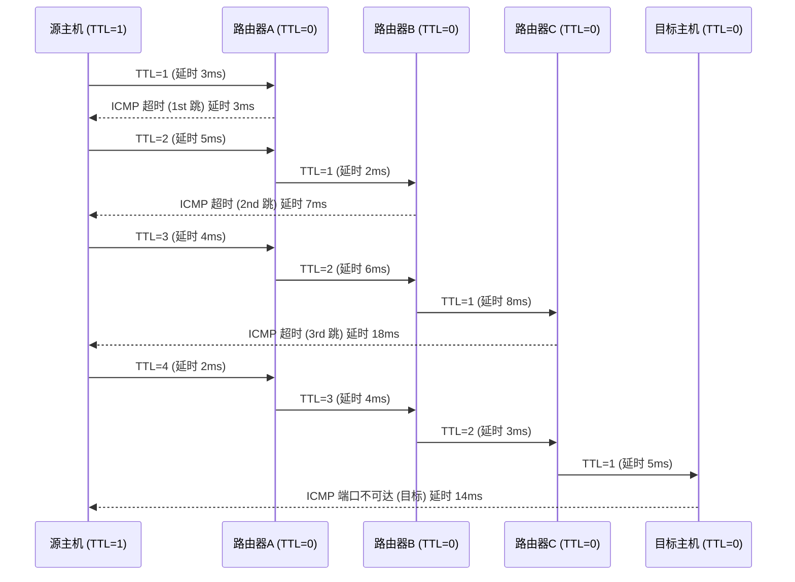

⭐路由追踪

`traceroute` 用于显示数据包从本地计算机到目标主机的路径，并帮助分析网络中的延迟和跳数。它是网络故障排查的重要工具之一。

## 1. **安装 `traceroute`** 🛠️

### 在 Ubuntu/Debian 上安装

```bash
sudo apt install traceroute
```

### 在 CentOS/RHEL 上安装

```bash
sudo yum install traceroute
```

## 2. **基本用法** 📡

### 1. 追踪目标主机

显示从本地计算机到目标主机的路径和延迟🌍:

```bash
$ traceroute www.zxzsk.com
```

示例输出：
```
traceroute to www.zxzsk.com (172.67.177.192), 64 hops max
  1   192.168.10.1  0.399ms  0.357ms  0.341ms 
  2   192.168.1.1  1.210ms  0.978ms  0.806ms 
  3   100.104.0.1  3.096ms  2.310ms  2.419ms 
  4   112.45.104.117  4.104ms  3.377ms  3.477ms 
  5   223.86.15.73  5.258ms  4.848ms  4.748ms 
  6   221.183.47.113  3.879ms  3.250ms  3.180ms 
  7   221.183.41.45  35.971ms  35.473ms  35.500ms 
  8   221.183.167.26  43.663ms  43.071ms  42.884ms 
  9   221.183.92.206  46.726ms  46.147ms  46.236ms 
 10   221.183.89.173  58.786ms  58.142ms  58.186ms 
 11   223.120.17.9  193.167ms  192.708ms  192.702ms 
 12   223.120.6.218  184.744ms  184.082ms  184.220ms 
 13   *  223.119.64.110  196.363ms  202.144ms 
 14   172.68.188.94  201.198ms  192.829ms  181.756ms 
 15   172.67.177.192  190.035ms  *  189.527ms
```

#### 每一行的内容解析：

- 跳数（Hop Number）： 每一行的开头是跳数（例如，第1跳、第2跳等）。这是数据包经过的路由器数量，表示数据包从源主机到目标主机的经过节点数。

- 路由器的IP地址或域名： 每个路由器的IP地址（例如 192.168.1.1）会显示在括号中。如果启用了 -n 选项，结果会仅显示IP地址。如果没有启用 -n，则可能显示域名。

- 延迟（Latency）： 每个跳数后面会显示三个延迟值（单位：毫秒ms），每个值对应一次探测包的响应时间。

- 星号（*）： 如果某一跳的探测包没有得到响应，输出会显示 *，表示超时或未响应。这可能是因为该路由器或防火墙设置了不回应 traceroute 请求。

### 2. 追踪目标IP

直接使用IP地址也是可以的：

```bash
$ traceroute 172.67.177.192 
```

示例输出：
```
traceroute to 172.67.177.192 (172.67.177.192), 64 hops max
  1   192.168.10.1  0.486ms  0.433ms  0.365ms 
  2   192.168.1.1  0.962ms  0.799ms  0.899ms 
  3   100.104.0.1  3.558ms  2.445ms  2.457ms 
  4   112.45.104.117  4.102ms  3.234ms  8.281ms 
  5   *  *  * 
  6   221.183.47.113  5.161ms  3.613ms  3.910ms 
  7   221.183.136.249  30.773ms  30.337ms  30.518ms 
  8   221.183.167.26  42.761ms  43.356ms  42.071ms 
  9   221.183.92.206  45.714ms  45.549ms  45.419ms 
 10   221.183.92.194  44.189ms  43.363ms  43.388ms 
 11   223.120.16.241  201.334ms  200.938ms  200.907ms 
 12   223.120.6.218  190.852ms  189.978ms  190.063ms 
 13   *  *  * 
 14   141.101.72.19  197.911ms  201.960ms  197.388ms 
 15   172.67.177.192  190.903ms  190.354ms  190.454ms 
```

## 3. **常用选项** 🧑‍💻

### 1. 设置最大跳数
```bash
$ traceroute -m 20 www.zxzsk.com
```
- `-m` 设置最大跳数，避免查询过多跳数导致输出冗长，快速定位问题！⏱️

### 2. 改变超时设置
```bash
$ traceroute -w 2 www.zxzsk.com
```
- `-w` 设置超时时间，单位为秒（默认为5秒）。⏳

### 3. 使用ICMP协议
```bash
$ traceroute -I www.zxzsk.com
```
- `-I` 使用ICMP协议，类似于ping命令，适用于防火墙过滤情况！🔐

### 4. 控制查询次数
```bash
$ traceroute -q 1 www.zxzsk.com
```
- `-q` 设置每跳查询次数，默认为3次，减少次数提高速度！⚡

## 4. **工作原理** 🧐

traceroute 命令通过逐跳探测的方式追踪数据包从源主机到目标主机的路径，它利用了**TTL（生存时间）和ICMP（Internet Control Message Protocol）**来逐步显示路由路径。

<details>
<summary>TTL</summary>
<p>
    **TTL（Time To Live）的作用和原理概括**：

    - **作用**：TTL 用于限制数据包在网络中的生存周期，防止数据包在网络中无限循环，从而避免网络拥塞。
    
    - **原理**：
    - 每个数据包在发送时会被赋予一个 TTL 值。
    - 每经过一个路由器或网络设备，TTL 值减 1。
    - 当 TTL 值变为 0 时，数据包被丢弃，源主机会收到一个 ICMP 超时消息，通知数据包已被丢弃。
    
    TTL 机制帮助网络设备管理数据包流动，确保网络的稳定性和性能，同时为网络诊断工具提供基础。
</p>
</details>



## 5. **`traceroute` 命令失效的情况** 💡

traceroute 命令在以下几种情况下可能失效或无法正常工作：

- 防火墙阻止：
   - 如果目标网络或中间节点的防火墙配置阻止了 ICMP 或 UDP 数据包，traceroute 可能无法获得响应或路径信息。 
    -  如果目标主机不响应 ICMP 或 UDP 请求，traceroute 将显示超时（timeout）信息。
- 网络设备不响应：某些网络设备可能配置为不响应 traceroute 请求，导致路径信息不完整。
- 网络分段：在某些情况下，网络路径可能经过多个网络分段，导致 traceroute 无法跟踪整个路径。
- TTL 超时：如果网络路径非常长，超过了 traceroute 命令的最大跳数限制（默认 30），则可能无法到达目标主机。
- VPN 或代理：通过 VPN 或代理服务器进行连接时，traceroute 可能只显示到 VPN 服务器或代理服务器的路径。
- 网络拥塞：在网络拥塞的情况下，traceroute 请求可能会超时，导致路径信息不准确。
- 网络拓扑变化：网络拓扑结构可能随时间变化，traceroute 结果可能不一致。

---

希望这个更新后的教程能帮助你快速掌握 traceroute 命令！🎉 任何问题都可以随时问我哦！😊