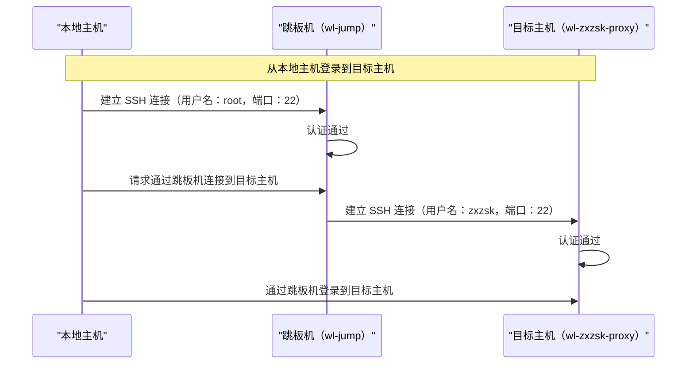

# Linux ssh 命令教程：安全远程登录 

## 1. 简介

- `ssh` 命令用于安全登录远程主机，以便在远程机上执行命令或传输数据。

- `ssh` 命令使用 SSH 协议进行安全通信，使用该协议的还有（用于文件传输的）scp、sftp 等命令。

## 2. 常见操作概览

| 操作                       | 命令格式                                  | 说明                               |
|----------------------------|-----------------------------------------|------------------------------------|
| 登录到远程主机               | `ssh <用户名>@<主机名>`                  | 使用指定用户名登录到远程主机。        |
| 指定端口登录                 | `ssh -p <端口> <用户名>@<主机名>`        | 使用非默认端口登录到远程主机。        |
| 执行远程命令                 | `ssh <用户名>@<主机名> <命令>`           | 在远程主机上执行命令。                |
| 显示帮助信息                | `ssh -h`                                | 显示 `ssh` 命令的帮助信息。          |

## 3. 密码登录

### 3.1 登录到远程主机

远程主机既可以是 ip，也可以是域名，例如要使用默认用户名登录到远程主机 `remote.example.com`：

```bash
$ ssh remote.example.com
```

如果需要使用特定的用户名 `user` 登录：

```bash
$ ssh user@remote.example.com
```
:::info 密码登录
每次登陆需要输入远程账号的密码，颇为不便。后面会配置免密登陆。
:::

### 3.2 指定端口登录

如果远程主机的 SSH 服务使用非默认端口（例如 2222）：

```bash
$ ssh -p 2222 user@remote.example.com
```

:::info ssh默认端口为22
:::

### 3.3 执行远程命令

要在远程主机上执行一个命令（如 `ls -l`）：

```bash
$ ssh user@remote.example.com 'ls -l'
```

如果命令有输出，会显示到当前终端:
```
Desktop
docs
Downloads
Music
...
```

## 4. 免密登陆

### 4.1 生成密钥

如果是新装的系统还没有生成过ssh密钥，可以使用以下命令生成密钥:

```bash
$ ssh-keygen
```

命令启动后，会发起三次确认，每次需要用户按 <kbd>Enter</kbd> 键确认

```bash
Generating public/private rsa key pair.
# highlight-next-line
Enter file in which to save the key (/home/soulio/.ssh/id_rsa): 
/home/soulio/.ssh/id_rsa already exists.
# highlight-start
Enter passphrase (empty for no passphrase): 
Enter same passphrase again: 
# highlight-end
```

生成密钥成功，输出如下提示，指明了密钥文件的存放位置：

```bash
# highlight-start
Your identification has been saved in /home/soulio/.ssh/id_rsa
Your public key has been saved in /home/soulio/.ssh/id_rsa.pub
# highlight-end
The key fingerprint is:
SHA256:WMtuxei0ZQvhOprd+7Q9GA/ZD6lADQiefKExOzI/waA soulio@vm-ubuntu
The key's randomart image is:
+---[RSA 3072]----+
|  . +...         |
| . = *...        |
|E o X . oo       |
|   + + =.=.      |
|    o ..S =o .   |
|     . =.*+.+    |
|      o =.o* o   |
|     + + .ooo .  |
|    o . ooo ..   |
+----[SHA256]-----+
```

### 4.2 把公钥部署到远程主机

使用以下命令将公钥部署到指定远程主机，部署成功后将来登录这台主机时便不需要输入密码了。

```bash
$ ssh-copy-id user@example.com
```

:::note
tips：如果你有多个公钥，可以在命令中加上 `-i 目录` 部署指定公钥。
:::

## 5. 配置文件.ssh/config

### 5.1 主机别名

`ssh` 命令支持使用配置文件来简化登录过程。可以编辑 `~/.ssh/config` 文件来添加远程主机配置：

```plaintext
Host myserver
    HostName remote.example.com
    User user
```

现在可以别名 myserver 登录 user@remote.example.com ：

```bash
$ ssh myserver
```

公钥 + 别名，一键登录远程主机真的很方便。

### 5.2 代理（跳板机）

如果你想要使用跳板机登录，参考如下配置 wl-jump 是跳板机别名，wl-zxzsk-proxy 是目标主机的别名。

```bash
Host wl-jump
    Hostname 111.111.111.111
    User root
    Port 22

Host wl-zxzsk-proxy
    Hostname 222.222.222.222
    User zxzsk
    Port 22
    ProxyJump wl-jump
```

让我们使用 Mermaid 图形语言来表示从本地主机登录到目标主机 `wl-zxzsk-proxy` 的过程：



- 在本地主机的角度看，本地主机登录了目标主机。
- 在目标主机的角度看，是跳板机登录了目标主机。

### 5.3 规范命名

每个人都可以定制一些规则来遵守它，让别名更加规范。以下是我的个人规范：

- 前缀：使用 vl 和 wl 区分局域网和公网设备
- 后缀：使用跳板机则添加 proxy 后缀
- 只使用小写
- 不使用特殊符号（@、!、# 等）
- 不能含有空格
- 不能与 SSH 选项名称相同


### 5.4 分组

使用 `*` 匹配一组主机名，设置共同配置：

```plaintext
Host prod-*
    User root
    Port 2222
```

在这个示例中，任何以 `prod-` 开头的别名都会继承 `User` 和 `Port` 的配置。

通过通配符分组，简化配置文件的管理和维护。就个人的区区几台设备用不上这个技巧。🔧

## 6. 使用 ssh 时的注意事项

- **密钥认证**：使用公钥认证比密码认证更安全，建议使用。
- **主机认证**：首次连接到新的主机时，SSH 会询问是否信任该主机的公钥，确保主机的真实性。
- **端口转发**：SSH 可以用于端口转发，将本地端口转发到远程主机上的端口。
- **防火墙和安全策略**：确保 SSH 服务的端口在防火墙中开放，并配置安全策略（如限制 IP 访问）。
- **会话管理**：使用 `tmux` 或 `screen` 可以保持远程会话，即使断开连接后也能继续工作。

## 7. 小贴士

:::tip 生成密钥时的可选选项
    - -t：指定密钥类型（如 RSA、ECDSA、Ed25519 等）。
    - -b：指定密钥长度（如 4096 位）。
    - -f：指定密钥文件的保存路径和名称。
```bash
$ ssh-keygen -t rsa -b 4096 -f ~/.ssh/my_rsa_key
```
:::


:::tip 免密登录(公钥认证)
将公钥复制到远程主机的 `~/.ssh/authorized_keys` 文件中，实现无密码登录：
```bash
$ ssh-copy-id user@remote.example.com
```
:::


:::tip 端口转发

使用 SSH 进行端口转发，将本地端口映射到远程主机上的端口：

```bash
$ ssh -L 8080:localhost:80 user@remote.example.com
```
:::


## 7. 总结

`ssh` 命令是 Linux 系统中用于远程登录和管理的基本工具。它通过加密通信协议提供安全的远程访问，保护数据传输的机密性和完整性。无论是登录到远程服务器、管理网络设备还是进行文件传输，`ssh` 都能帮你快速实现。🎯

掌握了 `ssh`，你就像一个网络管理员，可以随时安全地访问和管理远程系统，确保数据的安全传输。🔒

---

加油，继续在命令行中探索新技能！💪🏻 别忘了收藏在线知识库（[www.zxzsk.com](http://www.zxzsk.com)），让更多有用的知识为你提供帮助！😊

继续探索，你已经很棒啦！🌟